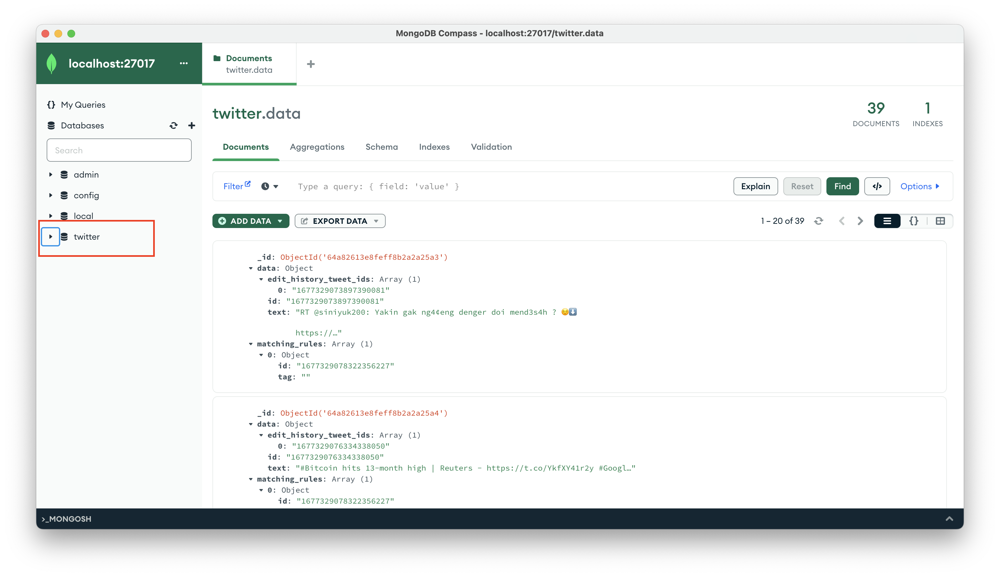

# Kafka PoC - Tweets Streaming to MongoDB

Author: Ale Casas [AL34N1X]
Kafka stack based on Stephane Maarek’s project [kafka-stack-docker-compose](https://github.com/simplesteph/kafka-stack-docker-compose)

The following exercise aims to introduce the learner to the following topics:

1) Docker. Continuing our first approach to infrastructure and contrainers, the idea is to be able to continue using cloud native technologies that allow us to work in an agile and consistent way.
2) Introduction to Kafka, basic components and use cases.
3) How producers and consumers interface with Kafka
4) Implement a solution that pulling out data from the Twitter API and consumers take the raw data and store it in MongoDB

Requirements:
- Docker
- Docker Compose
- Python 3.7+
- pip 
- Twitter Developer account
[Twitter Dev Account](https://dev.to/sumedhpatkar/beginners-guide-how-to-apply-for-a-twitter-developer-account-1kh7)
- MongoDB Client (e.g. Studio3T)
- MongoDB connection data `mongodb://localhost:27017` 

## Building your stack

1) Clone repository or download the zip file
2) Get into the directory `cd kafka_demo`
3) Run `pip install -r requirements.txt`
4) Create a MongoDB volume running the following command `docker volume create data-mongodb`
5) Get into the directory `kafka-stack-docker-compose` and run the docker-compose stack `docker-compose -f zk-single-kafka-single_mongo.yml up`
6) Create the twitter Topic `python create_topic.py` 
7) Edit the `producer.py` and populate with the data provided by the app created in Twitter.
   - access_token 
   - access_token_secret
   - bearer_token 
   - consumer_key
   - consumer_secret 
8) Open a new terminal and run the producer command `python producer.py` 
9) Open a new terminal and run the consumer command `python consumer.py`
10) After a while click `CTRL + C` and stop the `producer.py` and the `consumer.py`scripts
11) Open your MongoDB GUI and take a look to the new Database and collections created

## Alternative (Synthetic Data)

As you know, Twitter (now X) has introduced several changes on how to gain developer access.
If you face issues requesting Dev privileges to your acccount, you can use the sample data provided in this repository to simulate data streaming.

1) Clone repository or download the zip file
2) Get into the directory `cd kafka_demo`
3) Run `pip install -r requirements.txt`
4) Create a MongoDB volume running the following command `docker volume create data-mongodb`
5) Get into the directory `kafka-stack-docker-compose` and run the docker-compose stack `docker-compose -f zk-single-kafka-single_mongo.yml up`
6) Create the twitter Topic `python create_sample_topic.py` 
7) Open a new terminal and run the producer command `python sample_producer.py` 
8) Open a new terminal and run the consumer command `python sample_consumer.py`
9) After a while click `CTRL + C` and stop the `sample_producer.py` and the `sample_consumer.py`scripts
10) Open your MongoDB GUI and take a look to the new Database and collections created